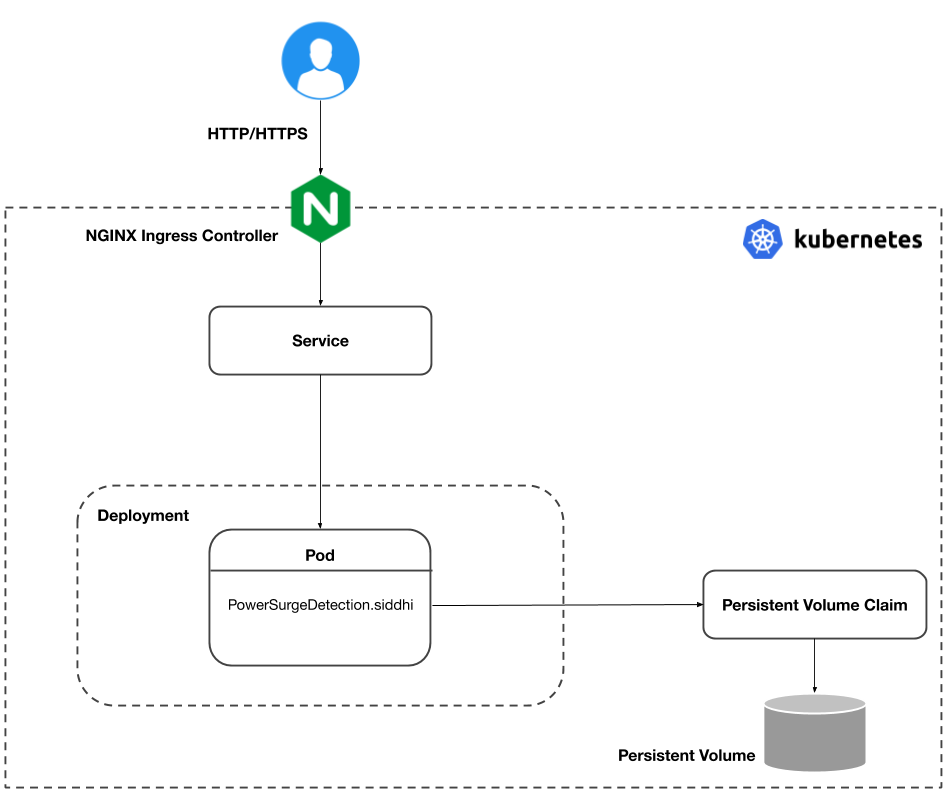

This scenario presents how to deploy and run a non-distributed stateful Siddhi Application on Kubernetes. 

**Note:** As Siddhi uses periodic state snapshots, the apps deployed in this mode can only achieve zero event loss
if they consume events from NATS Streaming or Kafka, else the events consumed between the last snapshot and the restart (after failure) will be lost.  

This scenario is implemented using the `PowerConsumptionSurgeDetection` app presented below.

```sql
@App:name("PowerConsumptionSurgeDetection")
@App:description("Consumes HTTP messages in JSON format, and alerts by logging a message once every 30 seconds, if the total power consumption in the last 1 minute is greater than or equal to 10000W.")

@source( type='http', 
         receiver.url='${RECEIVER_URL}',
         basic.auth.enabled='false', 
         @map(type='json'))
define stream DevicePowerStream(
       deviceType string, power int);

@sink(type='log', prefix='LOGGER')  
define stream PowerSurgeAlertStream(
       deviceType string, powerConsumed long);

@info(name='surge-detector')  
from DevicePowerStream#window.time(1 min) 
select deviceType, sum(power) as powerConsumed
group by deviceType
having powerConsumed > 10000
output first every 30 sec
insert into PowerSurgeAlertStream;
```


The above app consumes `JSON` messages via http sink in the format `{ 'deviceType': 'dryer', 'power': 6000 }`, and inserts them into `DevicePowerStream` stream. From which the `surge-detector` query calculates the total power consumed in the last 1 minute, and if the total value is greater than or equal to `10000`W, it generates an event once every 30 seconds, and inserts into the `PowerSurgeAlertStream` stream. The `PowerSurgeAlertStream` then logs them on the console using a log sink.

This app is stateful as it has a window of 1 minute, and running sum of power consumption, which it needs to be preserved during failures and restarts.

For more information in developing Siddhi Apps, refer the [Siddhi Documentation](http://siddhi.io/redirect/docs).

**Prerequisites for deploying the app**

- **Ingress** - To receive HTTP/HTTPS requests into Siddhi Apps running on Kubernetes.
- **Persistence Volume** - To preserve the periodic state snapshots of Siddhi. 
- **Siddhi Operator** - For deploying and managing Siddhi Apps on Kubernetes.

**Deployment Architecture**

The deployment architecture of the `PowerConsumptionSurgeDetection` App will be as follows. 



Here, the HTTP/HTTPS requests to the Siddhi App are sent through the NGINX ingress controller. The Siddhi app consumes and processes them while persisting its state as a snapshot to the persistent volume.

The next section provides instructions on installing the prerequisites.

