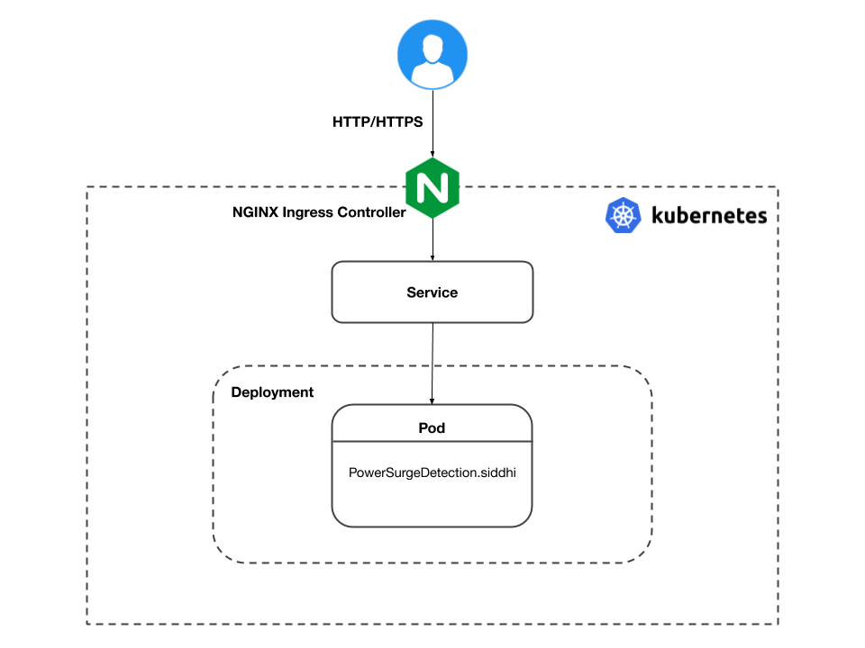

[Siddhi](http://siddhi.io) is a cloud-native, scalable, Streaming and Complex Event Processing System capable of building real-time analytics, data integration, notification and surveillance usecases.

This scenario presents how to deploy a stateless Siddhi Application on Kubernetes that receives HTTP requests and logs them. 

This use case is implemented using the `PowerSurgeDetection` app presented below.

```sql
@App:name("PowerSurgeDetection")
@App:description("Consumes HTTP messages in JSON format and logs them if the device type is 'dryer' and the power level is greater than or equal to 600W.")

@source( type='http', 
         receiver.url='${RECEIVER_URL}',
         basic.auth.enabled='false', 
         @map(type='json'))
define stream DevicePowerStream(
              deviceType string, power int);

@sink(type='log', prefix='LOGGER')  
define stream PowerSurgeAlertStream(
              deviceType string, power int);

@info(name='power-filter')  
from DevicePowerStream[deviceType == 'dryer' 
                       and power >= 600] 
select deviceType, power  
insert into PowerSurgeAlertStream;
```

The above app consumes `JSON` messages via http sink in the format `{ 'deviceType': 'dryer', 'power': 6000 }`, and inserts them into `DevicePowerStream` stream. From which the `surge-detector` query filters the events having device type `dryer` and the power consumption amount greater than or equals to `600`W, and inserts the filtered events into the `PowerSurgeAlertStream` stream. The `PowerSurgeAlertStream` stream then logs them on the console using a log sink.

This app is stateless as it only has an HTTP source to consume events, and filter query, and a log sink.

For more information in developing Siddhi Apps, refer the [Siddhi Documentation](http://siddhi.io/redirect/docs).

**Prerequisites for deploying the app**

- **Ingress** - As the App consumes events via HTTP, and Siddhi uses NGINX ingress controller to receive HTTP/HTTPS requests.
- **Siddhi Operator** - For deploying and managing Siddhi Apps on Kubernetes.

The architecture of the final SiddhiProcess deployment of this scenario can be illustrated using the following diagram. 



Users can send HTTP/HTTPS requests to the deployed Siddhi app through NGINX ingress controller. The Siddhi app will consume all those requests and process it.

The next section provides instructions on installing the prerequisites.
